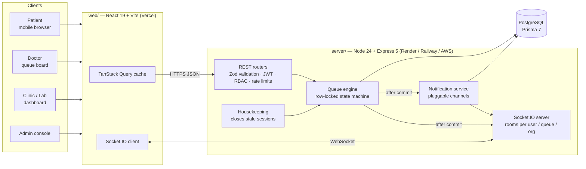
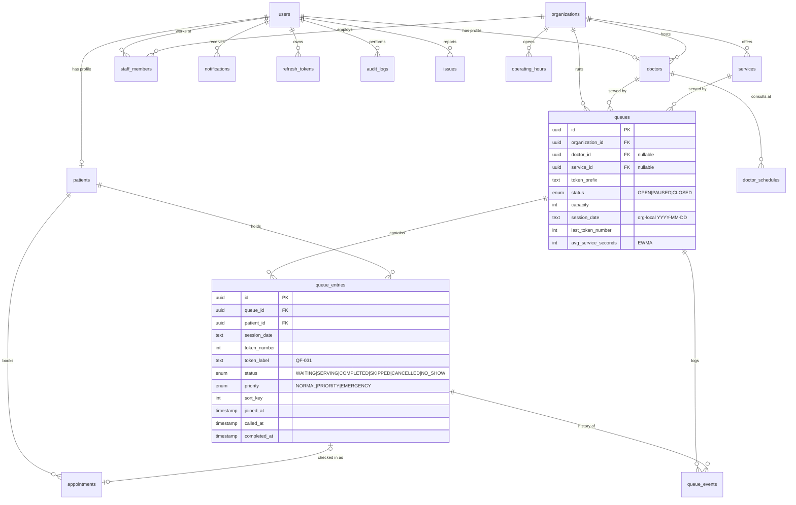

# QFree — System Design

> **Know your queue. Save your time.**
> Core model: **Patient → Queue → Healthcare Provider**. A patient joins and receives `QF-031`; the doctor serves `QF-024 → QF-025 → …`; as `QF-031` nears the front, the patient is notified.

Contents

1. [System architecture](#1-system-architecture)
2. [ER diagram](#2-er-diagram)
3. [Database schema](#3-database-schema)
4. [API specification](#4-api-specification)
5. [Frontend structure](#5-frontend-structure)
6. [Authentication and roles](#6-authentication-and-roles)
7. [Queue-management algorithm](#7-queue-management-algorithm)
8. [Real-time architecture](#8-real-time-architecture)
9. [Roadmap](#9-roadmap)

---

## 1. System architecture



| Layer | Choice | Why |
|---|---|---|
| Frontend | React 19, TypeScript, Vite 8, Tailwind 4, React Router 7, TanStack Query | Static SPA deploys anywhere (Vercel); Query cache is patched in place by socket events so screens never refresh. Vite was chosen over Next.js: every page is behind live data and auth, so SSR adds little. |
| Backend | Node 24, Express 5, TypeScript, Zod 4 | Express 5 forwards async errors natively; Zod validates every input at the edge. |
| Real-time | Socket.IO 4 | Rooms, auto-reconnect, long-polling fallback for restrictive hospital networks. |
| Database | PostgreSQL + Prisma 7 (`@prisma/adapter-pg`) | Row locks (`SELECT … FOR UPDATE`), partial unique indexes, `percentile_cont`, time-zone arithmetic for analytics. |
| Auth | JWT access token (15 min, memory only) + rotating refresh token (httpOnly cookie, hashed in DB) | Short-lived bearer for REST and sockets; theft-resistant session renewal. |

**Module layout (server):** `auth`, `queues` (logic · state · service · routes), `organizations`, `doctors`, `services`, `patients`, `notifications`, `analytics`, `issues`, `admin`, plus cross-cutting `lib/` (prisma, logger, audit, settings, time, tokens) and `middleware/` (auth, errors, rate limits).

**Clean-architecture boundaries**

- `queue.logic.ts` — pure functions (ordering, ETA, EWMA, re-queue keys). No I/O, fully unit-tested.
- `queue.state.ts` — read models: one DB round-trip → public snapshot / staff view / personal view.
- `queue.service.ts` — transactional state machine; collects side effects and emits them *after commit*.
- `*.routes.ts` — HTTP only: parse → authorize → call service → shape response.

## 2. ER diagram



## 3. Database schema

Source of truth: [`server/prisma/schema.prisma`](../server/prisma/schema.prisma) and migration [`20260926000000_init`](../server/prisma/migrations/20260926000000_init/migration.sql). There are 17 tables. The brief's ~12 were kept, with small normalizations:

| Table | Purpose | Notable constraints / indexes |
|---|---|---|
| `users` | Identity for all roles | unique `email`; index `role` |
| `refresh_tokens` | Hashed rotating refresh tokens | unique `token_hash` |
| `patients` | Minimal profile (DOB, gender only) | unique `user_id` |
| `organizations` | Clinics, laboratories, hospitals and diagnostic centres, as one table with a `type` column (no duplicated clinic/lab tables) | index `type`, `city` |
| `staff_members` | User ↔ organization with `OWNER / MANAGER / RECEPTIONIST` | unique (`organization_id`, `user_id`) |
| `operating_hours` | Weekly hours in the org's timezone | unique (`organization_id`, `day_of_week`), CHECK day 0–6 |
| `doctors`, `doctor_schedules` | Doctor profile, consultation timings | CHECK positive durations |
| `services` | Lab tests, diagnostics, consultations | unique (`organization_id`, `name`); soft delete |
| `queues` | One per doctor and/or service | CHECK capacity 1–5000 |
| `queue_entries` | Tokens | unique (`queue_id`, `session_date`, `token_number`); **partial unique** (`queue_id`, `patient_id`) WHERE status IN (WAITING, SERVING) → no duplicate active entries; **partial unique** (`queue_id`) WHERE status = SERVING → one patient with the doctor at a time |
| `queue_events` | Append-only history of every transition | index (`queue_id`, `created_at`) |
| `appointments` | Future booking, linked to an entry on check-in | |
| `notifications` | In-app inbox | index (`user_id`, `read_at`, `created_at`) |
| `audit_logs` | Security-relevant actions, including viewing patient details | index by entity, actor, time |
| `issues` | User-reported problems | index `status` |
| `system_settings` | Admin-editable platform rules (key/value JSON) | |

All tables have UUID primary keys, `created_at` / `updated_at` where they apply, and foreign keys with explicit `ON DELETE` behaviour. History is preserved: entries are never deleted, services are soft-deleted, and doctors and queues are archived.

## 4. API specification

The complete OpenAPI 3.1 spec is [`server/openapi.yaml`](../server/openapi.yaml). It is served as Swagger UI at **`/api/docs`** and as JSON at `/api/openapi.json`.

Conventions: JSON everywhere. Errors are `{ "error": { "code", "message", "details?" } }` (e.g. `QUEUE_FULL`, `ALREADY_IN_QUEUE`, `OUTSIDE_HOURS`). Lists return `{ items, total, page, pageSize, totalPages }`.

| Area | Endpoints |
|---|---|
| Auth | `POST /api/auth/register` · `login` · `refresh` · `logout` · `change-password` · `GET /api/auth/me` |
| Discovery (public) | `GET /api/doctors` · `/doctors/:id` · `/doctors/specializations` · `GET /api/organizations` · `/organizations/:id` · `/organizations/cities` · aliases `GET /api/clinics`, `/api/laboratories` · `GET /api/services` |
| Queue status (public) | `GET /api/queues` · `/queues/:id` · `/queues/:id/status` (adds caller's own entry when signed in) |
| Patient | `POST /api/queues/:id/join` · `DELETE /api/queues/:id/leave` · `GET /api/queues/:id/me` · `GET/PATCH /api/patients/me` · `GET /api/patients/me/queues` · `/patients/me/history` · `/patients/:id/history` |
| Queue operations (doctor / staff / admin) | `GET /queues/:id/staff` · `POST /queues/:id/open` · `pause` · `resume` · `close` · `next` · `complete` · `POST /queues/:id/entries/:entryId/call` · `skip` · `requeue` · `no-show` · `cancel` · `priority` · `GET /queues/:id/entries/:entryId` · `/history` · `/events` |
| Queue configuration | `POST /api/queues` · `PATCH /api/queues/:id` · `DELETE /api/queues/:id` (archive) |
| Doctor self-service | `GET/PATCH /api/doctors/me` · `PATCH /doctors/me/availability` · `PUT /doctors/me/schedule` |
| Organization | `POST /api/organizations` · `PATCH /:id` · `GET /:id/manage` · `PUT /:id/hours` · `POST/DELETE /:id/staff` · `POST/DELETE /:id/doctors` · `POST/PATCH/DELETE /:id/services` · `GET /organizations/mine/list` |
| Notifications | `GET /api/notifications` · `/unread-count` · `PATCH /:id/read` · `POST /read-all` |
| Analytics | `GET /api/analytics/doctor` · `/organizations/:id` · `/queues/:id` · `/platform` — `?from&to&bucket=day|week|month` |
| Issues | `POST /api/issues` · `GET /api/issues/mine` |
| Admin | `GET /api/admin/overview` · `users` (+ `PATCH`) · `doctors` · `organizations` (+ `PATCH`) · `services` · `queues` · `audit-logs` · `issues` (+ `PATCH`) · `GET/PUT settings` |

## 5. Frontend structure

```
web/src
├── main.tsx                 providers: Query, Router, Auth, Toast
├── App.tsx                  routes, role guards, lazy-loaded role sections
├── lib/                     api (fetch + silent refresh), auth context, socket manager, types, format
├── hooks/useLive.ts         useQueueLive · useStaffQueue · useLiveSnapshots · useSocketConnected
├── layouts/                 PublicLayout · DashboardLayout (role nav, live notification listener)
├── components/
│   ├── ui/                  Button, Card, Field/Input/Select, Table, Tabs, Toggle, Dialog, Toast …
│   ├── queue/               LiveQueueCard · QueueBoard · QueueTile · QueueForm · Status indicators
│   └── charts/              AnalyticsPanel (Recharts, validated palette, table views)
└── pages/
    ├── public/              Landing · About · How it works · Search · Provider/Doctor details · QueuePage · Login · Register
    ├── patient/             Dashboard · My queues · History · Profile
    ├── doctor/              Dashboard · Today's queue · Patient details · History · Schedule · Analytics · Profile · Setup
    ├── org/                 Dashboard · Queues (+ board) · Doctors · Services · Staff · Hours · Reports · Analytics · Profile · Setup
    ├── admin/               Dashboard · Users · Doctors · Clinics · Laboratories · Services · Queues · Reports & audit · Analytics · Settings
    └── shared/              Notifications · Report issue · Entry (patient) details · Change password
```

"Join Queue" and "Live Queue Status" are the same URL, `/queues/:id`. It shows the public queue with a **Join** button, then turns into the patient's live card once they join. Search, provider, and queue pages render inside the dashboard shell when signed in, and inside the public shell otherwise.

**Accessibility and usability for elderly and non-technical users:** 17px base font, touch targets of at least 44px, and a single primary action per screen. Status is always shown as dot + icon + words, never colour alone. `aria-live` regions cover changing numbers, and there is a skip link, a native `<dialog>` for modals, full keyboard support, and a reduced-motion fallback. The phone vibrates and the card flashes when the turn approaches. Dark mode is defined as its own token set, not an automatic inversion.

## 6. Authentication and roles

```mermaid
sequenceDiagram
  participant B as Browser
  participant A as API
  participant DB
  B->>A: POST /auth/login (email, password)
  A->>DB: bcrypt verify (constant-time; dummy hash for unknown emails)
  A-->>B: { accessToken (15 min) } + Set-Cookie qf_rt (httpOnly, 7 d)
  B->>A: GET /api/... Authorization: Bearer <access>
  Note over A: verify JWT, then re-read user (deactivation is immediate)
  B->>A: POST /auth/refresh (cookie) on 401
  A->>DB: revoke old token, store hash of new one (rotation)
  A-->>B: new accessToken + new cookie
  Note over A: an old token replayed after 60 s ⇒ theft ⇒ revoke all sessions
```

| Role | Can |
|---|---|
| `PATIENT` | Search, join/leave queues (at most N at once), see own position, history, notifications |
| `DOCTOR` | Manage own profile, schedule and availability; operate and configure **own** queues; create a personal practice; own analytics |
| `ORG_ADMIN` (+ staff role) | `RECEPTIONIST`: operate every queue of the org. `MANAGER` / `OWNER`: also configure queues, doctors, services, staff and hours |
| `ADMIN` | Everything, plus users, verification and suspension, settings, audit log, issues |

Authorization is enforced **per resource** in `modules/access.ts` (e.g. `canManageQueue` = admin ∨ queue's doctor ∨ staff of the queue's organization). The same functions guard REST routes and socket rooms. Admin registration is impossible through the API.

**Other security measures:** bcrypt (cost 12). Zod validation on every input, and Prisma parameterized queries (raw SQL uses tagged templates only). `helmet` headers, strict CORS allow-list, 100 KB JSON limit. Rate limits: 300/min general, 20 per 15 min on credentials, 20/min on joins. Open redirects are blocked after login. The audit log records logins, failures, role changes, priority changes, out-of-hours openings, and every view of patient details. Public queue data contains token numbers only, never names. `trust proxy` and `Secure; SameSite=None` cookies are enabled in production, so the app is ready for HTTPS.

## 7. Queue-management algorithm

**State machine** (`queue.service.ts`)

```
WAITING ──call──▶ SERVING ──complete / call next──▶ COMPLETED
   │                 │
   │ leave / cancel  └──skip (not present)──▶ SKIPPED ──requeue──▶ WAITING
   ▼                                           │
CANCELLED                                      └──no-show / queue closes──▶ NO_SHOW
```

**Consistency.** Every mutation runs in one transaction that starts with `SELECT … FOR UPDATE` on the queue row, which serializes operations per queue while other queues proceed in parallel. Tokens come from `UPDATE queues SET last_token_number = last_token_number + 1 RETURNING`, so they are gap-free and unique. Two partial unique indexes back this up at the database level: one active entry per patient per queue, and one serving patient per queue. Notifications and broadcasts are sent only **after commit**.

**Ordering.** Waiting patients are sorted by `(priority band DESC, sort_key ASC, token ASC)`. Bands: `EMERGENCY > PRIORITY > NORMAL`, FIFO inside each. `sort_key = token × 1000` on join. The gaps let a skipped patient who returns be re-inserted **behind `requeueGrace` (default 2) waiting patients** instead of jumping to the front. If there is no integer gap left, the band is renumbered.

**Controlled priority.** Only staff or the doctor can set it, only while the patient is waiting, a reason of at least 3 characters is mandatory, and the change is written to both `queue_events` and `audit_logs`.

**Wait estimate.** `ETA = patientsAhead × avgService + remaining(current)`, where `remaining = max(avg − elapsed, min(60 s, 0.2·avg))`. The floor stops an overrunning consultation from reading as "done".

**Learning the pace.** On each completion, `avg ← 0.8·avg + 0.2·clamp(sample, avg/3, 3·avg)`, bounded to 1–60 min. Clamping means a mis-click (5 s) or a forgotten "complete" (3 h) barely moves it.

**Rules on join:** the queue is OPEN (or PAUSED, if allowed) for *today's* session, the org is active, the doctor is available, the patient has no active entry in this queue and is under the platform-wide cap, and capacity is not exhausted.

**Sessions and hours.** Tokens restart daily, and `session_date` is computed in the organization's timezone. Opening outside operating hours returns `409 OUTSIDE_HOURS` unless explicitly overridden (and audited). A housekeeping job runs every 5 minutes and at startup. It closes queues left open past midnight: waiting entries become cancelled (with a notification), serving entries become completed, and skipped entries become no-shows.

**Notifications.** Joined, turn approaching (once, when `ahead ≤ approachingThreshold`, default 3), your turn, skipped, re-queued, cancelled by staff, paused/resumed, closed, and priority granted.

## 8. Real-time architecture

```mermaid
sequenceDiagram
  participant Doc as Doctor board
  participant API
  participant PG as PostgreSQL
  participant IO as Socket.IO
  participant Pat as Patient phone
  Doc->>API: POST /queues/:id/next
  API->>PG: BEGIN; lock queue; complete QF-024; QF-025 → SERVING; COMMIT
  API->>PG: insert notifications
  API->>IO: publishQueue(id) — one read, many views
  IO-->>Pat: queue:entry {currentToken QF-025, ahead 5, eta 29 min}
  IO-->>Pat: notification:new (if threshold crossed)
  IO-->>Doc: queue:staff {serving, waiting[], stats}
  Note over IO: also queue:snapshot → public watchers, org:queue → clinic dashboard
```

| Room | Who may join | Events |
|---|---|---|
| `user:{id}` | the authenticated user (automatic) | `notification:new`, `queue:entry` (own position) |
| `queue:{id}` | anyone (`queue:watch`) | `queue:snapshot` — anonymous-safe |
| `queue-staff:{id}` | `canManageQueue` (`queue:watch-staff`) | `queue:staff` — full list with names |
| `org:{id}` | organization staff (`org:watch`) | `org:queue` |

The client keeps one connection, authenticates with the access token in the handshake, reconnects when identity changes, re-joins rooms after any reconnect, and patches the TanStack Query cache in place. A 60-second background refetch is the safety net for networks that block WebSockets (Socket.IO also falls back to long-polling). An admin deactivating an account disconnects its sockets immediately.

**Scaling out:** add `@socket.io/redis-adapter` so `publishQueue` fans out across instances. The queue lock lives in PostgreSQL, so API instances are already stateless.

## 9. Roadmap

| Phase | Scope | Status |
|---|---|---|
| 1 Foundations | Monorepo, env validation, logging, Prisma schema + migrations, seed | ✅ |
| 2 Auth & RBAC | Register/login, refresh rotation, roles, resource guards, audit | ✅ tested |
| 3 Queue engine | State machine, locking, tokens, ordering, ETA/EWMA, priority, skip/requeue/no-show, hours, housekeeping | ✅ tested (incl. concurrency) |
| 4 Real-time | Socket rooms, publish-after-commit, notifications | ✅ tested |
| 5 Providers | Organizations, doctors, services, staff, hours, schedules | ✅ |
| 6 Frontend | Public, patient, doctor, clinic/lab and admin apps | ✅ verified in browser |
| 7 Analytics & admin | Aggregates, charts, reports/CSV, users, verification, issues, settings | ✅ |
| 8 Next | Walk-in patients added by reception (no smartphone) · QR code to join at the door · SMS/WhatsApp channel (implement `NotificationChannel`) · Web Push via service worker · appointment booking using `appointments` → check-in creates an entry · multilingual UI (Hindi, Marathi, …) · payments · lab report tracking · multi-branch rollups · ML wait prediction from `queue_events` · Redis adapter · Playwright E2E in CI | planned |

The extension points already exist: `NotificationChannel.register`, `appointments.queue_entry_id`, `Organization` supporting many per owner (branches), the `queue_events` history as training data, and `system_settings` for feature flags.
